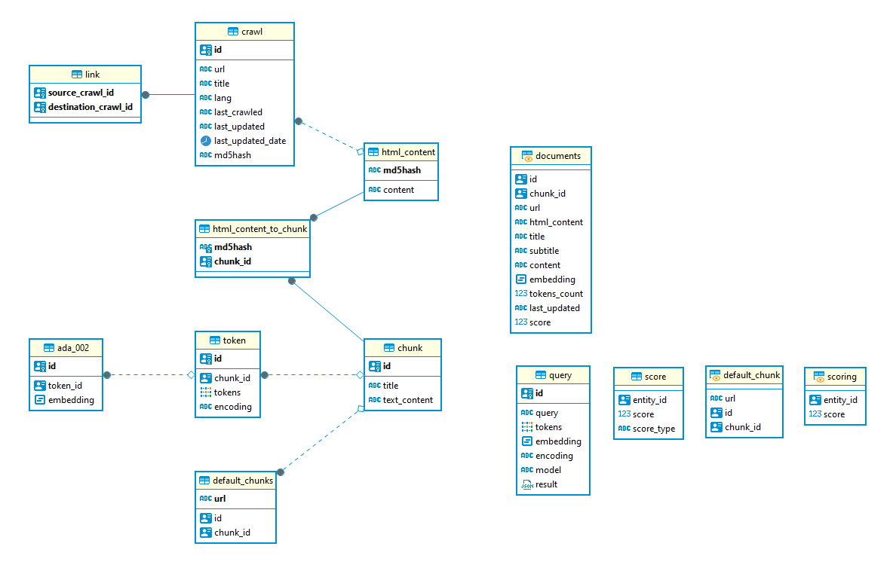

# Test technique - PostgreSQL

## Tâches :
- [x] Créer un repository publique sur GitHub
- [ ] Créer une vue score qui donne un score à chaque ligne de la table crawl
- [ ] Ecrire une fonction recherche('mot-clé') qui retourne le top dix des documents avec le plus haut score contenant le mot-clé

## Questions

### Que contiennent les tables dans les schéma louis_v005? Expliquer la structure relationelle et la fonction de chaque table.
Voici le diagramme de la structure relationnelle des tables du schéma louis_v005 :

En analysant le structure, on peut voir que la table `crawl` contient les informations de base de chaque page web, comme l'url, le titre etc.
La table `html_content` contient le contenu html de chaque page web. 
La table `script` contient les scripts de chaque page web.
La table `link` contient les liens de chaque page web.
La table `chunk` fait référence à un morceau du contenu d'une page web

D'abord, on peut voir qu'il y'a une relation de dépendance entre la table `link` et `crawl`, `link` contient un "source_crawl" et une "destination_crawl" ce qui signifie que chaque lien a une page web source et une page web de destination.

Ensuite, on peut voir qu'il y'a une relation de dépendance entre la table `html_content` et `html_content_to_chunk` mais également entre `html_content_to_chunk` et `chunk`.

### Quelle distribution prennent les valeurs de longueur du contenu?

### Expliquer le calcul en fonction de la distribution spécifique des valeurs de longueurs de html_content script

### Expliquer et discuter de la performance de votre fonction recherche
