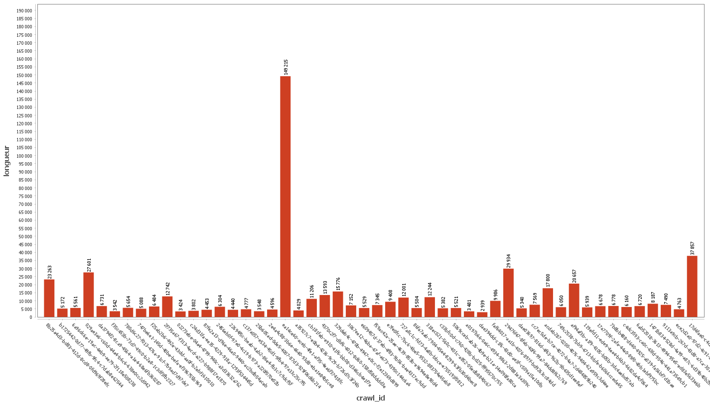

# Test technique - PostgreSQL

## Tâches :
- [x] Créer un repository publique sur GitHub
- [x] Créer une vue score qui donne un score à chaque ligne de la table crawl en fonction de la longueur du contenu html comparé à la distribution de cette colonne
- [x] Ecrire une fonction recherche('mot-clé') qui retourne le top dix des documents avec le plus haut score contenant le mot-clé 

## Questions

### Que contiennent les tables dans les schéma louis_v005? Expliquer la structure relationelle et la fonction de chaque table.
Voici le diagramme de la structure relationnelle des tables du schéma louis_v005 :

En analysant la structure, on peut voir que la table `crawl` contient les informations de base de chaque page web, comme l'url, le titre etc.
La table `html_content` contient le contenu html de chaque page web, il a un hash md5 et un contenu.
La table `chunk` fait référence à un morceau du contenu d'une page web, il a un titre et un contenu.
La table `html_content_to_chunk` est une table de jointure entre  `html_content` et `chunk`. Cela signifie que chaque contenu hashé  dans la table `html_content` est associé à un ou plusieurs contenu dans la table `chunk`.
La table `link` contient les liens de chaque page web, avec une source et une destination.
La table `token` semble faire référence aux balises html.
La table `default_chunks` semble être une table qui à un url associe un chunk.
La table `ada_002` semble être une table qui associe un token à un embedding c'est à dire un vecteur de nombres réels qui sert à représenter un mot dans un espace vectoriel.


### Quelle distribution prennent les valeurs de longueur du contenu?
J'ai créé une vue qui contient la longueur du contenu de chaque ligne crawl.
Grâce à celle ci on remarque que la valeur maximum est 1 206 285 et la valeur minimum 210.

```sql
CREATE OR REPLACE VIEW "mia.ben-redjeb.1@ens.etsmtl.ca"."longueurContenu" as 
SELECT
    c.id AS crawl_id,
    LENGTH(h.content) AS longueur
FROM louis_v005.crawl c
JOIN louis_v005.html_content h ON c.md5hash = h.md5hash;
```

J'ai réalisé un histogramme de la vue précédente. Voici le résultat :


### Expliquer le calcul en fonction de la distribution spécifique des valeurs de longueurs de html_content script

J'utillise la fonction PERCENT_RANK() pour calculer le score de chaque page web. La fonction PERCENT_RANK() permet de calculer le rang d'une ligne dans un ensemble de données par rapport au nombre total de lignes. Elle attribue une valeur entre 0 et 1, où 0 représente la première ligne (plus basse) et 1 représente la dernière ligne (plus haute) dans le classement. 

Dans ce cas la fonction PERCENT_RANK() st calculée comme suit :

```sql
CREATE OR REPLACE VIEW "mia.ben-redjeb.1@ens.etsmtl.ca"."score" as 
SELECT
    c.id AS crawl_id,
    PERCENT_RANK() OVER (ORDER BY LENGTH(h.content)) AS score
FROM louis_v005.crawl c
JOIN louis_v005.html_content h ON c.md5hash = h.md5hash;
```

Ici PERCENT_RANK() est utilisée pour calculer le pourcentage de rang en fonction de la longueur du contenu HTML stocké dans la colonne "content" de la table `louis_v005.html_content`. Les données sont triées par ordre croissant de la longueur du contenu (LENGTH(h.content)), de sorte que les rangs les plus bas seront attribués aux contenus les plus courts, et les rangs les plus élevés aux contenus les plus longs.

### Expliquer et discuter de la performance de votre fonction recherche
```sql
CREATE OR REPLACE FUNCTION recherche(keyword text)
RETURNS TABLE (crawl_id uuid, score double precision) AS $$
BEGIN
    RETURN QUERY
    SELECT
        c.id AS crawl_id,
        s.score
    FROM
        "mia.ben-redjeb.1@ens.etsmtl.ca"."score" s
    JOIN louis_v005.crawl c ON s.crawl_id = c.id
    JOIN louis_v005.html_content h ON c.md5hash = h.md5hash
    WHERE
        h.content ILIKE '%' || keyword || '%'
    ORDER BY s.score DESC
    LIMIT 10;
END;
$$ LANGUAGE plpgsql;
```

1. Rechercher du texte (WHERE):
   - Complexité : O(n), n est la taille de la table `html_content`.

3. Jointures :
   - Complexité : peut varier de O(n*log(n)) à O(n^2) en fonction de la taille des tables

4. Tri :
   - Complexité : dépend du nombre de lignes à trier. Dans ce cas, avec une limite de 10, la complexité du tri est O(10) = O(1)

La complexité de la fonction dépend de la complexité la plus élevée parmi ces étapes. On remarque que la complexité est majoritairement déterminée par la recherche de texte (O(n)) et par les jointures (O(n*log(n)) à O(n^2)). Il serait nécessaire d'optimiser au maximum la fonction pour des table ayant une grosse quantité de données.